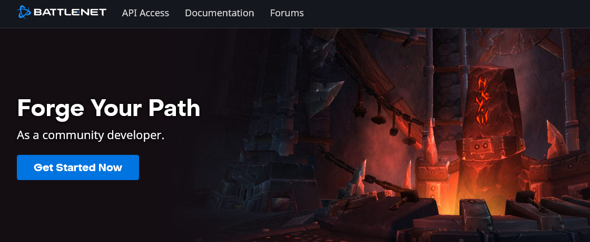
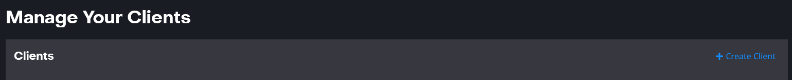
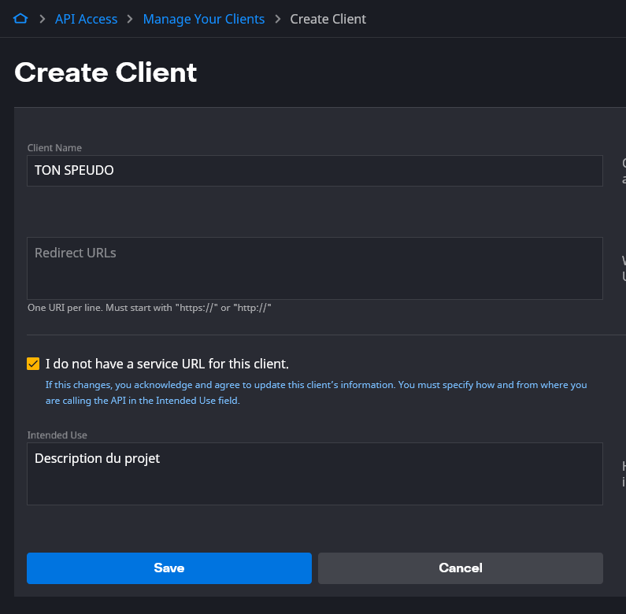
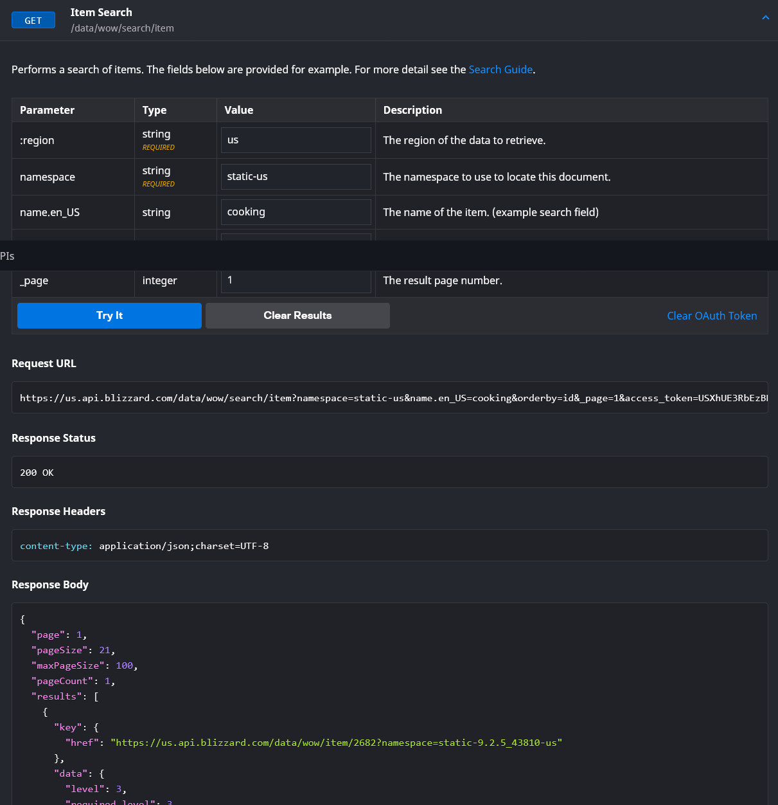
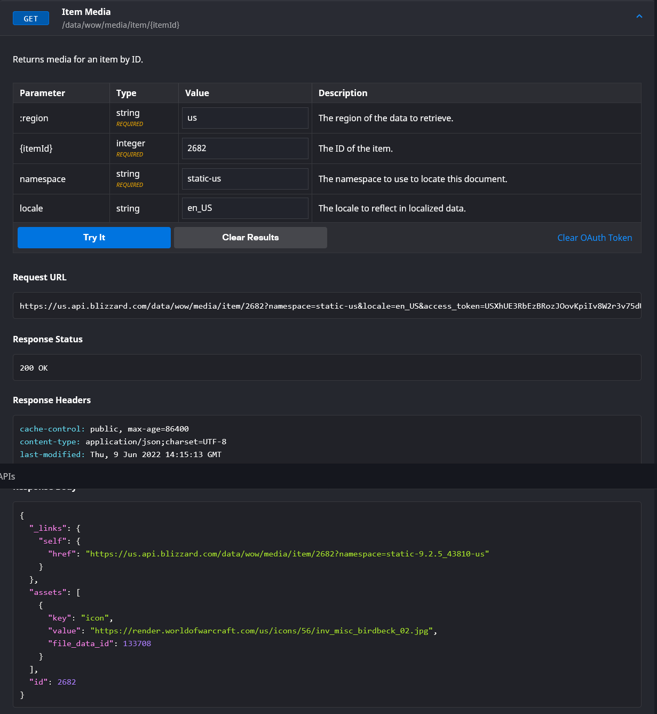

# Premiere ebauche pour l'API WOW

## Connection

Au prealable, telecharger l'Authentificator Blizzard, y lier son sompte battle.net
Se rendre sur https://develop.battle.net/

### Allez sur API Acces

-  se connecter a son compte Battle.Net et valider l'autorisation sur l'auth.

-  remplir Client Name, cocher la case I do not have ... et mettre une breve description dans Intended Use, puis SAVE

-  retour page precedente, cliques sur ton client que tu viens de creer et tu arrives sur Manage client

tu y trouveras ton Client ID et ton Client Secret en faisant SHOW SECRET
petit conseil, re ouvres une nouvelle page pour te connecter a l'api car tu vas devoir copier/coller les deux clients pour acceder a l'API

https://develop.battle.net/documentation/world-of-warcraft/game-data-apis

Lorsque tu vas vouloir faire une GET sur une des requetes, ca te demanderas tes deux clefs et ensuite tu auras acces a toute la base de donnees WOW.

### La nourriture surtrouve dans ITEM API

#### dans l'onglet ITEM SEARCH

-  il faut juste preciser dans le parameter name.en_US : cooking et tu obtiens la liste de tous les items lies a la nourriture avec tout le detail

`https://us.api.blizzard.com/data/wow/search/item?namespace=static-us&name.en_US=cooking&orderby=id&_page=1&access_token=USXhUE3RbEzBRozJOovKpiIv8W2r3v75dU`

-  ensuite aec l'id ded chaque item, tu peux cible envore plus et obtenir l'image dans une autre requete

### Exemple pour l'item ID 2682

`https://us.api.blizzard.com/data/wow/media/item/2682?namespace=static-us&locale=en_US&access_token=USXhUE3RbEzBRozJOovKpiIv8W2r3v75dU`

